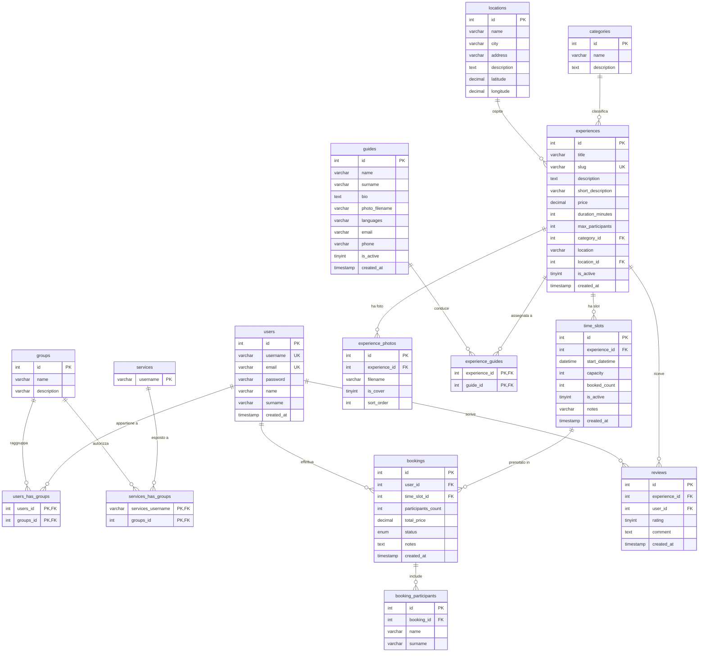

# Diagramma ER — Esperienze & Tour

Schema completo del database `progettotecnologia` (15 tabelle).

.png>)

> Immagine renderizzata: `Diagramma_ER(sfondo_bianco).png` (versione a sfondo trasparente: `Diagramma ER.png`).
> Il sorgente Mermaid qui sotto è la fonte di verità: per rigenerare l'immagine copialo su
> [mermaid.live](https://mermaid.live) ed esporta in PNG/SVG, oppure aprilo in VS Code con
> l'estensione *Markdown Preview Mermaid Support*. Su GitHub viene renderizzato automaticamente.

## Legenda relazioni

| Relazione | Cardinalità | Note |
|---|---|---|
| `users` ↔ `groups` | N:M (via `users_has_groups`) | Sistema di gruppi/permessi (Slice 1) |
| `services` ↔ `groups` | N:M (via `services_has_groups`) | Autorizzazione servizi per gruppo |
| `categories` → `experiences` | 1:N | `ON DELETE SET NULL` |
| `locations` → `experiences` | 1:N | `ON DELETE SET NULL` |
| `experiences` → `experience_photos` | 1:N | `ON DELETE CASCADE` |
| `experiences` ↔ `guides` | N:M (via `experience_guides`) | Una guida può condurre più esperienze e viceversa |
| `experiences` → `time_slots` | 1:N | `ON DELETE CASCADE` |
| `time_slots` → `bookings` | 1:N | `ON DELETE CASCADE` |
| `users` → `bookings` | 1:N | `ON DELETE CASCADE` |
| `bookings` → `booking_participants` | 1:N | `ON DELETE CASCADE` |
| `experiences` → `reviews` | 1:N | `ON DELETE CASCADE` |
| `users` → `reviews` | 1:N | `ON DELETE CASCADE`; vincolo `UNIQUE(experience_id, user_id)` → una recensione per utente/esperienza |
